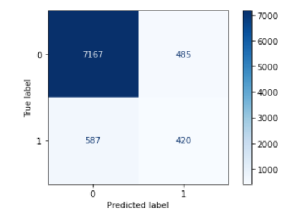
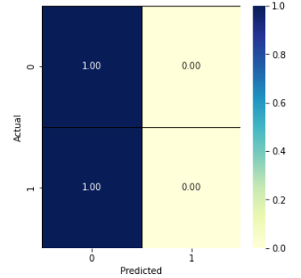

# Bank marketing dataset

## **Discussion and Conclusions**

We followed the CRISP-DM (Cross Industry Standard Process for Data Mining) methodology in our work, which comprises the 6 steps listed below:

### **1. Business understanding**

In this work, we are supporting a Portuguese banking institution to predict whether or not its clients are going to subscribe to a bank term deposit.

### **2. Data understanding**

The data is related with direct marketing campaigns of the banking institution. The marketing campaigns were based on phone calls. Often, more than one contact to the same client was required, in order to access if the product (bank term deposit) would be ('yes') or not ('no') subscribed.

We are using two datasets:

1. bank-full.csv with all examples and 17 inputs, ordered by date;
2. bank.csv with 10% of the examples and 17 inputs, randomly selected from 3;

Below, we identify our output variable (desired target):

y - has the client subscribed a term deposit? (binary: 'yes', 'no')

### **3. Data preparation**

* Dealing with categorical features

    * One Hot Encoding for:
    job, marital, contact, month, poutcome
    * Binarization for: 
    default, loan, housing, y
    * Ordinal Categorical Encoding for: 
    Education (primary= 0, secondary = 1, tertiary = 3, unknown samples were excluded, only 4% of the data)
    * Drop of the column Duration because of the high correlation with the target column y. As always the duration is equals 0, y equals 0 too.

* Dealing with numerical features
	Normalization of the columns age, balance, day, duration, campaign, pdays and previous

### **4. Modeling**

In this step, we created six models listed below:

    1 - K-Nearest Neighbors (K-NN)  
    2 - Decision Tree 
    3 - Random Forest 
    4 - Neural Network Multilayer Perceptron (MLP) 
    5 - Neural Network Ensemble 
    6 - Heterogeneous Ensemble

First, for the models 1-5 we proceed with the fine-tuning to find the best parameters (for each model), using the cross-validation strategy. 

Then, we trained all the models again with the best parameters and proceeded with the final test (using 20% of the data that the models have not seen before). 

Later on, we executed the heterogenous ensemble with the simplest version of the models.

### **5. Evaluation**

In this step, we evaluated the models listed in step 4 (Modeling), which are:  K-NN, Decision Tree, Random Forest, Neural Networks MLP, Neural Networks Committee, and Heterogeneous Committee in Python.

## **Final results:**

Best model: 

The best result was obtained with the Random Forest, where the accuracy was 89%.

In the confusion matrix, we observed that 587 were predictions of class 0, but actually of class 1. While only 420 records were predicted as of class 0 and class 1.

The results of the minority class were precision -> 0.46, recall -> 0.42  and f1-score -> 0.44.

In the confusion matrix, we observed that 587 were predictions of class 0, but actually of class 1. In contrast, only 420 records were predicted as of class 0 and class 1.

The results of the minority class were precision -> 0.46, recall -> 0.42  and f1-score -> 0.44.

Although, as we can see in the DummyClassifier with the most frequent strategy, predicting everything as 0, we also get a score of 89%

We have implemented cross-validation with resampling only in the train folds manually (oversampling with RandomOversamling, SMOTE, undersampling with RandomUnderSampling, and both strategies at the same time, but this last one has taken too long processing time and we decided it was unfeasible for the time we had.

And unfortunately, in spite of following the recommendations for dealing with imbalanced datasets, we could not get better results than with the DummyClassifier with the most frequent strategy.

## **Deployment** 

In the final step 6, we exported each model (1-5) to be utilized in the deployment phase.
